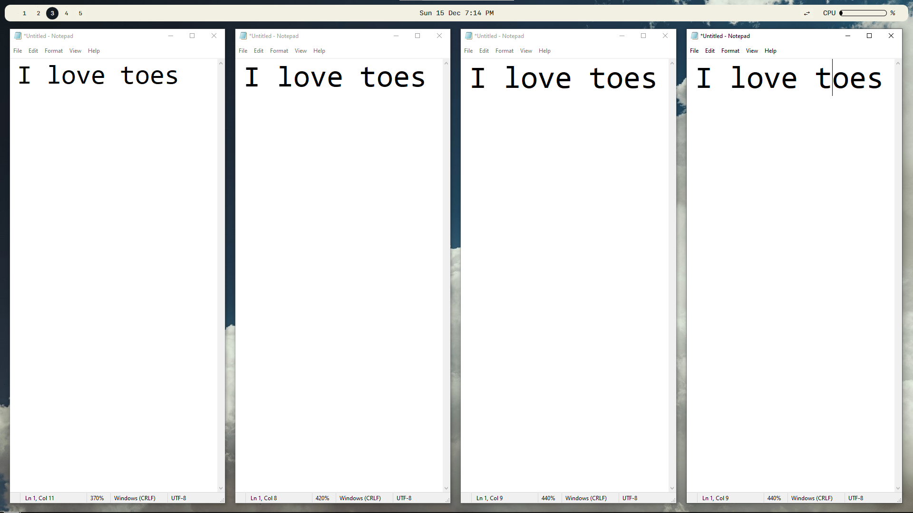
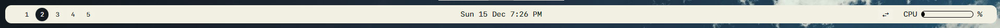
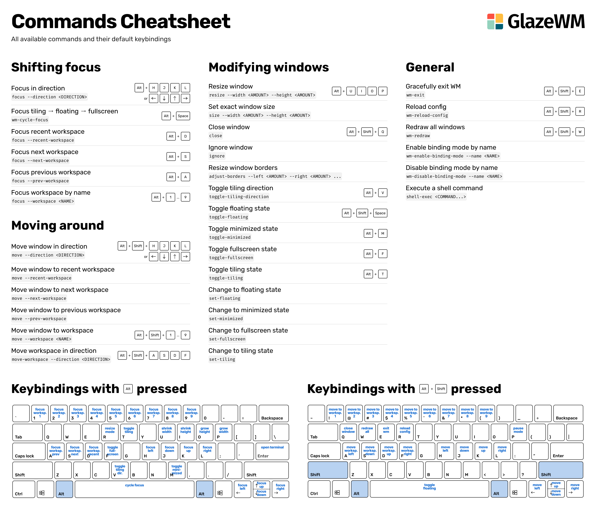
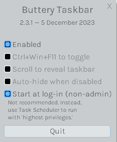
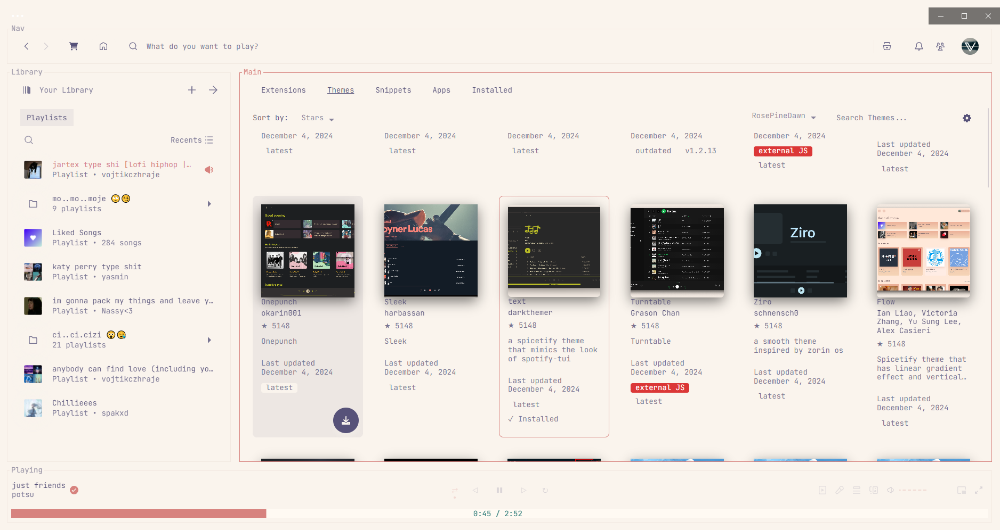

       
    <h1 align="center">Creamy 🌻 </h1>
    <h3 align="center">cutest windows rice!</h3>
    
{ no idea why i'm making this repo it's completelly useless 😿 }

   

## `🎲` |  Table of contents
-  <a href="#--applications">Applications</a>  
- <a href="#--configuration">Configuration</a>  
- <a href="#--honorable-mentions">Honorable Mentions</a>  

## `📦` | Applications
### 🍙 Download These!!~~
- [GlazeWM](https://github.com/glzr-io/glazewm/releases/download/v3.7.0/glazewm-v3.7.0.exe)
- [PowerToys](https://github.com/microsoft/PowerToys/releases/download/v0.86.0/PowerToysSetup-0.86.0-x64.exe)
- [ButteryTaskbar](https://github.com/LuisThiamNye/ButteryTaskbar2/releases/download/2.3.1/buttery-taskbar.exe)

#### Aditional ones
- [Spicetify (spotify themes)](https://spicetify.app/docs/advanced-usage/installation/)
- [Tokyo Night (discord theme)](https://github.com/ashtrath/Tokyo-Night)
- [Ayu (vsc theme)](https://github.com/dempfi/ayu)

### ➥ Windows Manager 
- Not sure who likes it but stacking/floating windows managers sucks so do Windows one (i'm the only hater  💢).
- So to solve this annoying problem we will use revolutionary [GlazeWM](https://github.com/glzr-io/glazewm) 👅

    
Example 😏

    
    - We use this and everyone will ask us how can we be so cool (aura)  
    - That brings us to...

### ➥ Taskbar
- Windows comes with this ugly ass taskbar 🤮 (once i will start care about performance i will switch to it back...) so we will modify it a bit, because we are cool like that
- We will use [ZEBAR](https://github.com/glzr-io/zebar), now it comes with GlazeWM not sure how it will be in future, if they change it figure it out 😛
- Also we will use [Buttery Taskbar](https://github.com/LuisThiamNye/ButteryTaskbar2) which will just hide our old Windows Taskbar >w<

    
Example 🧐

    - Idk if you blind or smth but it's literally showed in the example above, but whatever here is your showcase dummy
    
    - Ik it's cool you don't have to tell me 🙆‍♂️

### ➥ PowerToys
- Idk what you want to hear about [PowerToys](https://github.com/microsoft/PowerToys), but it has some pretty nieche features but also some pretty useless
- let's not think about it as extra bloat (it is i'm using only 2 features from it... 😀)

    
Example 😶

    - Istg you are <b>LAZY ASS</b> 😤, go search PowerToys yourself it's one of the most popular Windows tools OMG.   
    - I ain't adding a example of PowerToys (we saving github storage with this one [give me copilot for free plspslsdfldsj🤗]).

## `🔨` | Configuration
- Okay here we are cooking the main souce, so download the stuff we were talking (if you didn't read my description of the apps you will get executed 👿)

- Sooo... if you didn't yet clone this repo clone it now somewhere where you will be able to find it 👧 (documents if you are dumb and can't think)

### ➥ GlazeWM
- Alright so navigate to `%userprofile%/.glzr` and go folder named `glazewm`. Now open another explorer and go to the `cloned repo => bin => glazewm` and copy `config.yaml` to the original `glazewm` folder and BANG 🔫, you have configured GlazeWM with my configuration 😲

    
Keybinds ⌨

    - I know that you probably don't know the keybinds so here they are. You can find them in the official documenatition since i didn't change any, since i'm lazy person 💤
    

### ➥ Zebar
- To configure zebar navigate to `%userprofile%/.glzr` and go folder named `zebar`. Now open another explorer and go to the `cloned repo => bin => zebar` and copy `folder starter` there and press `Replace Files`. Now you have this cool ass taskbar
- Bu.. b.. but voooooj~~ i still have the old Windows taskb- SHUT UP 💢, alright let's hide it together 👨‍❤️‍💋‍👨

### ➥  Buttery Taskbar
- Launch it, go to tray icons and click on it, copy my settings and hurray!  

### Another configuration
- Know you nerds don't want to stop here so let's rice some things that doesn't 

### ➥  Spotfiy
-  [Spicetify](https://spicetify.app/docs/advanced-usage/installation/) is pretty cool spotify modification if you want to customize your system more, my recomendation is `text theme` with `RosePineDown` color pallet

    
Example 🥗

    - Ofc you want to see example 🥟
    
    - Ik it's cool you don't have to tell me 🙆‍♂️

### ➥  Discord
- You can use theme like [Tokyo Night](https://github.com/ashtrath/Tokyo-Night), since the default white discord ones are worse than fuc*ing flashbang

### ➥  Visual Studio Code
- Download [Ayu](https://github.com/dempfi/ayu) theme, it's my favorite white vsc theme since my eyes don't get hurt 🌭

## `📢` | Honorable mentions
- I would like to mention me because i'm such a wonderful person like fr
