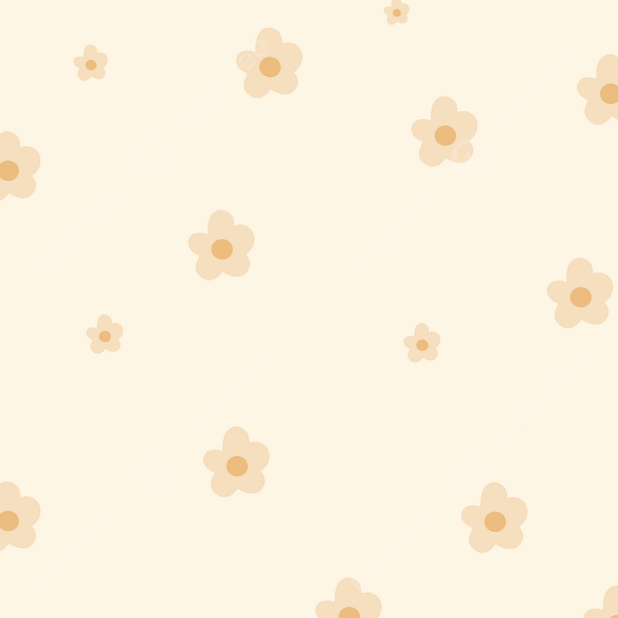
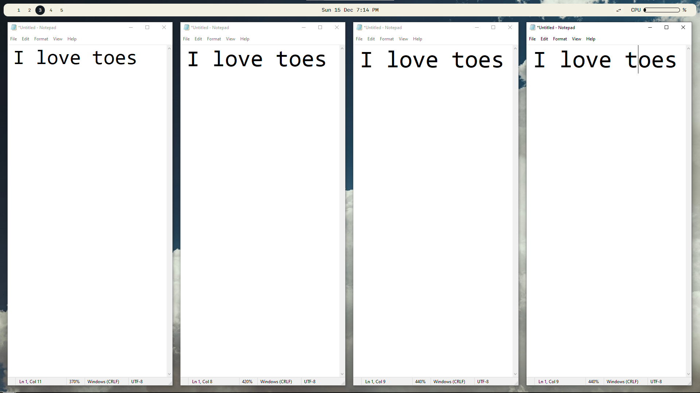
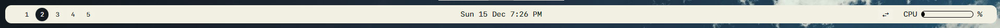
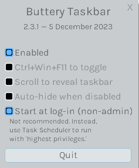
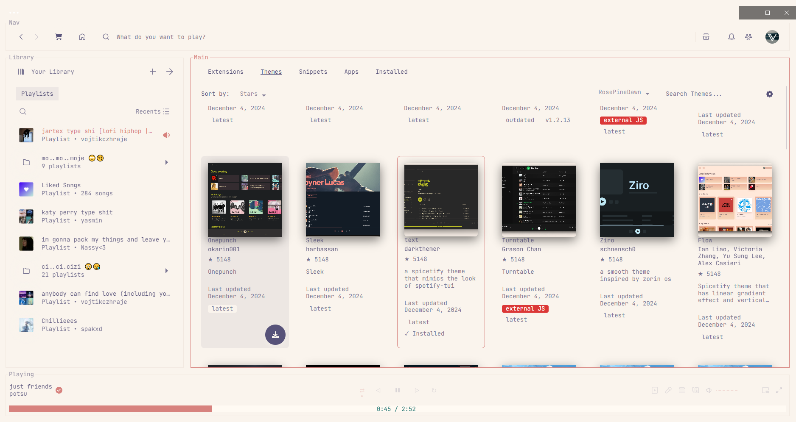

<p align="center">
     <br /> 
    <h1 align="center">Creamy 🌻 </h1>
    <p align="center">
        <a href="#--applications">Applications</a> • 
        <a href="#--configuration">Configuration</a> •
        <a href="#--honorable-mentions">Honorable Mentions</a>
    </p>
</p>


## `📦` | Applications
### ➥ Main:
- [GlazeWM](https://github.com/glzr-io/glazewm/releases/download/v3.7.0/glazewm-v3.7.0.exe)
- [PowerToys](https://github.com/microsoft/PowerToys/releases/download/v0.86.0/PowerToysSetup-0.86.0-x64.exe)
- [ButteryTaskbar](https://github.com/LuisThiamNye/ButteryTaskbar2/releases/download/2.3.1/buttery-taskbar.exe) <br />

####  Additonal:
- Spotify
    - [Spicetify](https://spicetify.app/docs/advanced-usage/installation/)
- Discord
    - [Vencord](https://vencord.dev/download/)
    - [Tokyo Night (theme)](https://github.com/ashtrath/Tokyo-Night)
- Visual Studio Code
    - [Ayu (theme)](https://github.com/dempfi/ayu)

### ➥ Windows Manager 
- Windows comes with Floating/Stacking Windows Manager, which can get really messy if working with multiple apps at once.
- Also we will be using "Workspaces", which will keep our work organised.
- We will use [GlazeWM](https://github.com/glzr-io/glazewm), which will solve it.

<details>
    <summary>Example</summary>
    
    - We will use this and everyone will ask us how can we be so cool (aura) <br />
    
</details>

### ➥ Taskbar
- We won't be using default windows taskbar since it's bot very much customizable.
- Instead we will use [ZEBAR](https://github.com/glzr-io/zebar), that comes with GlazeWM now.
- Also we will use [Buttery Taskbar](https://github.com/LuisThiamNye/ButteryTaskbar2) to hide Windows taskbar. (it will be still accessible)

<details>
    <summary>Example</summary>
    
</details>

### ➥ PowerToys
-  [PowerToys](https://github.com/microsoft/PowerToys), is Microsoft application that allows you to add cool features to Windows that doesn't come pre-installed. 


## `🔨` | Configuration
- Download the applications at <a href="#--applications">Applications</a>.
- If you need to look what each program does read  <a href="#--applications">Applications</a>.
- Clone this repository if not done yet, and place it somewhere easily accessible (documents).
- Follow my steps and you should be able to replicate my setup without any issues.

### ➥ GlazeWM
- Navigate to `%userprofile%/.glzr` and go to folder named `glazewm`. Now open another explorer and go to the `cloned repo => bin => glazewm` and copy `config.yaml` to `%userprofile%/.glzr/glazewm`

<details>
    <summary>Keybinds</summary>
    - These are Keybinds i use. They are the default ones, so you can check them also in the official GlazeWM documentation.
    
</details>

### ➥ Zebar
- To configure zebar navigate to `%userprofile%/.glzr` and go folder named `zebar`. Now open another explorer and go to the `cloned repo => bin => zebar` and copy folder `starter` into `%userprofile%/.glzr/zebar` and press `Replace Files`. Now you have this cool ass taskbar

### ➥  Buttery Taskbar
- To hide taskbar, run `ButteryTaskbar => Go to tray icons on Windows Taskbar => Click on ButteryTaskbar there => Copy my settings`



### Another configuration
- You don't need to go any further to configure Windows, this are just nice additions that could make your system look even better.

### ➥  Spotfiy
-  [Spicetify](https://spicetify.app/docs/advanced-usage/installation/) is pretty cool spotify modification if you want to customize your spotify, my recomendation is `text theme` with `RosePineDown` color pallet.

<details>
    <summary>Example</summary>
    
</details>

### ➥  Discord
- Download and install [Vencord](https://vencord.dev/download/) (modification to the official discord client) or [Vesktop](https://github.com/Vencord/Vesktop) (lightweight discord client with Vencord pre-installed)
- Go to `discord settings => backup & restore => import settings` and import `vencord-settings.json` that can be found in `bin/discord`
- Now go to  `discord settings => themes => online themes` and paste there:

```
https://raw.githubusercontent.com/Dyzean/Tokyo-Night/main/themes/tokyo-night.theme.css
```

### ➥  Visual Studio Code
- In VSC `navigate to extension tab` and search `Ayu`, click on the first link that will appear and click on `install`

## `📢` | Honorable mentions
- I would like to mention me because i'm such a wonderful person like fr
